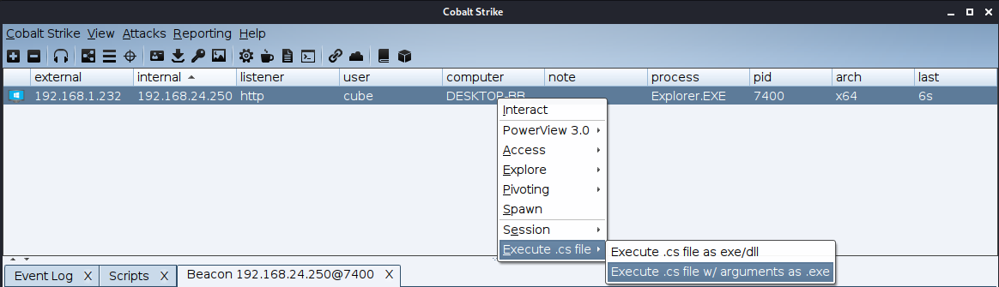
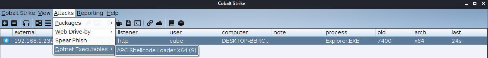

# SharpeningCobaltStrike
In realtime compiling of dotnet v35/v40 exe/dll binaries + obfuscation with ConfuserEx on your linux cobalt strike server.


When you specify a .cs file to compile and execute on a beacon, the compiler will automaticly search for all .cs dependencies in that source directory and sub directories and compile against them so there is no need for merging everything into 1 .cs file. By default, all the .dll files under `Compiler/References/net*/` will be loaded as a References to each compiled project. If you want better opsec and  load just the necessary .dll files as References you can do that by dropping a file called `Refs` in the source directory of the project you are compiling and it will import just those .dll names instead of everything.
Refs Example
```
root@kali:/# cat Rubeus-master/Rubeus/Refs 

System.DirectoryServices.dll
System.DirectoryServices.AccountManagement.dll
System.dll
mscorlib.dll
System.Core.dll
System.IdentityModel.dll
#ItWillIgnoreLinesStartingWith#.dll
```

The compiler can be used outside of Cobalt Strike and it might be a good idea to do that for new projects just to verify that there are no missing References, if there are References missing just drop them to `Compiler/References/net*/`
```
root@kali:/Compiler# dotnet build -c Release ; dotnet bin/Release/netcoreapp2.1/Compiler.dll -s /Rubeus-master/Rubeus/Program.cs -f /tmp/rub.exe
Microsoft (R) Build Engine version 16.2.37902+b5aaefc9f for .NET Core
Copyright (C) Microsoft Corporation. All rights reserved.

  Restore completed in 60.77 ms for /opt/C2/Cobaltstrike/scripts/SharpCobaltStrike/Compiler/Compiler.csproj.
  Compiler -> /opt/C2/Cobaltstrike/scripts/SharpCobaltStrike/Compiler/bin/Release/netcoreapp2.1/Compiler.dll

Build succeeded.
    0 Warning(s)
    0 Error(s)

Time Elapsed 00:00:01.48
[*]Compiling..
Source Dir    :  ../Rubeus-master/Rubeus
Source File   :  ../Rubeus-master/Rubeus/test.cs
Output Kind   :  ConsoleApplication
.Net Version  :  Net40
Platform      :  AnyCpu
References    :  /Compiler/References/net40/System.IdentityModel.dll, /Compiler/References/net40/System.Core.dll, /Compiler/References/net40/System.Management.dll, /Compiler/References/net40/System.dll, /Compiler/References/net40/System.DirectoryServices.AccountManagement.dll, /Compiler/References/net40/System.Management.Automation.dll, /Compiler/References/net40/mscorlib.dll, /Compiler/References/net40/System.DirectoryServices.dll
Optimize      :  False
Confuse       :  False
UnsafeCompile :  False
```

Another use case is that we can use this to compile .Net loaders to inject beacon shellcode into processes



This project uses a modified version of [SharpGen](https://github.com/cobbr/SharpGen) to compile .cs source files and obfuscate them with ConfuserEx. All creds to [@cobbr](https://github.com/cobbr) for making the compiler, more detials on it here
* https://cobbr.io/SharpGen.html
* https://github.com/cobbr/SharpGen
* https://github.com/cobbr/Covenant

The APC shellcode loader is taken from https://github.com/FuzzySecurity/Sharp-Suite/tree/master/UrbanBishop 

To use this you first need to install dotnet core sdk
```
wget https://packages.microsoft.com/config/ubuntu/19.10/packages-microsoft-prod.deb -O packages-microsoft-prod.deb
sudo dpkg -i packages-microsoft-prod.deb
sudo apt-get update
sudo apt-get install apt-transport-https
sudo apt-get update
sudo apt-get install dotnet-sdk-2.1
```
